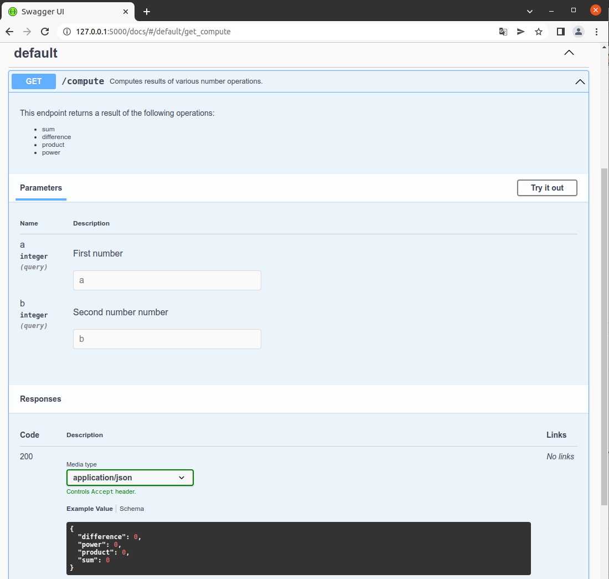

Getting Started
===============

Installation
____________

Install the library

.. code-block:: bash

   pip install flask-ninja

Quick Example
_____________

So you can see, that it is really simple and powerful.

``main.py``

.. code-block:: python

    from flask import Flask
    from flask_ninja import NinjaAPI
    from pydantic import BaseModel

    app = Flask(__name__)
    api = NinjaAPI(app)

    class Response(BaseModel):
        """Response model containing results of various number operations."""
        sum: int
        difference: int
        product: int
        power: int

    @api.get("/compute")
    def compute(a: int, b: int) -> Response:
        """Computes results of various number operations.

        This endpoint returns a result of the following operations:
        - sum
        - difference
        - product
        - power

        :param int a: First number
        :param int b: Second number number
        """
        return Response(
            sum=a + b,
            difference=a - b,
            product=a * b,
            power=a ** b
        )

    if __name__ == "__main__":
        app.run()

Run ``python main.py`` and open your browser at http://127.0.0.1:5000/compute?a=1&b=2 .

You will see the json:

.. code-block:: json

    {
        "difference":-1,
        "power":1,
        "product":2,
        "sum":3
    }

Now you've just created an API that:

* receives an HTTP GET request at ``/compute`` ednpoint
* takes, validates and type-casts GET parameters ``a`` and ``b``
* decodes the returned pydantic model into json
* generates an OpenAPI schema for the ``/compute`` endpoint using the endpoint docstrings

Interactive API docs
____________________

Now go  to http://127.0.0.1:5000/docs/

You will see the automatic, interactive API documentation (Provided by the OpenAPI/Swagger UI)

